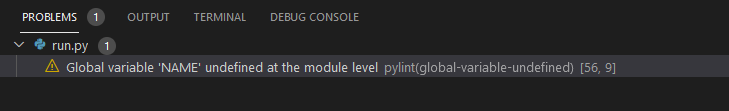

# Hangman Game

[View the live project here](https://hangman-games.herokuapp.com/)

## Contents
1. [Introduction](#Introduction)

2. [User Experience](#User-Experience)

3. [Target](#Target)

4. [Design](#Design)

5. [Features](#Features)

6. [Bugs](#Bugs)

7. [Other Features](#Other-Features)

8. [Features Left to Implement](#Feature-Left-to-Implement)

9. [Technologies Used](#Technologies-Used)

10. [Frameworks Libraries and Programs Used](#Frameworks-Libraries-and-Programs-Used)

11. [Testing](#Testing)

    - [Testings.md](assets/test-file/testings.md)

12. [Deployment](#Deployment)

13. [Make a clone](#Make-a-clone)

14. [Credit](#Credit)

15. [Acknowledgements](#Acknowledgements)
***

## Introduction

This is my 3rd project at code institute. I developed hangman the word game, which runs in the python terminal and is deployed on Heroku, usually, this game is a 2-player game however, the version I have created is played between the user and computer. In this game, users guess the words by choosing letters. The user has 6 chances for selecting the wrong letter before the game is over. In the starting user sees a hangman image and 1 row of dashes. If the user guesses the correct letter of the word, then that letter will appear in the row of dashes, otherwise, users will lose 1 of their 6 chances and they will get the next hangman image. If users guess incorrectly 6 times, then they will lose all their chances and the game will be over. Users can play this game an unlimited amount of times.

[Go Top](#Hangman-Game)

## User Experience

### Ideal User Demographic
* New users.
* Current users.

### User Stories

#### New users :
* As a new player, I want this game to start easily.
* As a new player, I want to see the full instructions about how to play and what I need to do to continue.
* As a new player, I want to see the correct or incorrect selected letters in the terminal while playing.
* As a new player, I want this game to be challenging therefore I do not want access to the word list.

#### Current users :
* As a current player, I want random words every time.
* As a current player, I should have fun with the game by ensuring it runs smoothly with interesting words.

[Go Top](#Hangman-Game)

## Target
* In this game, I have added a background image of gallows as this directly relates to hangman.This sets the seen for the game.
* At the starting of the game when the user enters their name if it’s a name made up of letters then the user will see a big title saying “Hangman”. I did this so the user can easily understand that they have entered the game correctly.
* In the game, I have made the user chances visible. This has been done to make it easy for the user to know how they are progressing in the game and so they can see how many tries they have used and how they have left so they can play carefully.

#### Skeleton
* I used [Figma](https://www.figma.com/file/7ut2bGOE3cAV0KdPhhgvKx/hangman?node-id=0%3A1) Wireframe to attach the following pages:

#### Desktop Tablet Mobile Page

[Go Top](#Hangman-Game)

## Design

 ### Colour Schema
* I used four colours in this game. The colour blue was used for the big Hangman title, Hangman images, and for tee instructions, Yellow was used for all the inputs, red was used for input of an invalid name, incorrect guess, and if the word/letter is not in the list and green was used if the user guesses the correct word/letter as well as If they win the game.
* Colorama was used to import the colours into the python terminal.

#### Typography
* I used a font from [Colorama](https://pypi.org/project/colorama/), I imported colorama into the python terminal.
* I used the font Bright for all the text.

#### Imagery
* I used one background image on the page. This image is of a hangman gallows.
* I used this image to easily inform users that this website is about hangman. This image does not distract the user in game because I overlayed light colour on it.

[Go Top](#Hangman-Game)

## Features

1. Starting page.
2. Guess the word page.
3. End game.
4. Play again.

#### Starting page :
* On the starting page, users will get an input for entering their name, if the user enters fewer than 2 letters or digits, they will get an error message. If the user enters a valid name, then they will see their name below the hangman title text. After this step users will get 2 options either to see the instructions or to start playing the game. If the user selects the instructions option, they will see instructions about how to play this game and at the bottom of the instructions text, they will see 2 more options. The 2 options the user can choose from are “Are you ready to play?” if the user selects Y they will enter in the main game where they guess the word but if they select N then the terminal will exit with a message saying, “See you again, when you are ready”.

  All the images are found [here](assets/game-screenshot/screenshot.md)

#### Guess the word page :
* On the guess the word page, users will get an image of a hangman with a row of dashes, with 6 lives. On this page users have to guess letters of a word which is in the games word list, if the users guess is incorrect, they will see the next part of the hangman image and the user will lose 1 life, but if the user guesses the correct letter, then that letter is added in the row of dashes and hangman image and lives will stay same. When the user enters the correct letter, they will also get a message to say well-done with their username. If users select a letter they have used before they will receive a message saying “you have already tried this word and if users tried a number or other special character, then they will see the message that this letter is not in the word list. But the hangman image and lives will stay the same.

  All the images are found [here](assets/game-screenshot/screenshot.md)

#### End game :
* At the end of the game, if the user guesses all the letters correctly, then the user will get a message saying “congratulations” or if the user guesses the letters incorrectly, and all their lives are lost then the users will get a full hangman image with the message “sorry your lives have run out” with the correct word which they were trying to guess at the end of the game.

  All the images are found [here](assets/game-screenshot/screenshot.md)

#### Play again :
* Users will get the play again option whether they win or lose. If they select Y they the game will restart with a new word. If they select N then they will get a message saying “thanks for playing see you again” with a big goodbye title after this they will exit the game.

  All the images are found [here](assets/game-screenshot/screenshot.md)

This game is following this flow diagram:

## Bugs
* The first bug I was having issues with was getting a random word every time. The reason I had this bug was because my code was not using loop to cycle through the word list cells in gspread sheet.
* I solved this problem with the help of stack overflow.

## Issue Left
* The game is working smoothly. I didn’t leave any bugs in the game but there are 2 errors. The first error is (Global variable ‘Name’ undefined at the module level), and the second error is (Else clause on loop without a break statement).

* I have included screenshots of the errors below:
#### Error

[Go Top](#Hangman-Game)

## Other Features
* I used gspread sheet for the word list, because if you import your word list file to the terminal, then the user can see the word list. I developed the game in this way to make the game interesting and challenging.
* I imported OS into the python terminal to clear the terminal of the previous text according to the next option.
* I imported Time into the terminal to add a delay during the game in between the user selecting an option and the next option being displayed. For example, I added time for the phrases (wait…) and (game loading…) as it gives a nice effect in a terminal game.
* The entered username is saved in the terminal, because when the user replays the game after either winning or losing in the same session his name will not need to be re-entered unless they exit the game.

### Feature Left to Implement
* The username is saved in the terminal where if the user exits the game and re-enters their name will already be there.
* A feature that I would have liked to implement is a hangman background image in the terminal.

